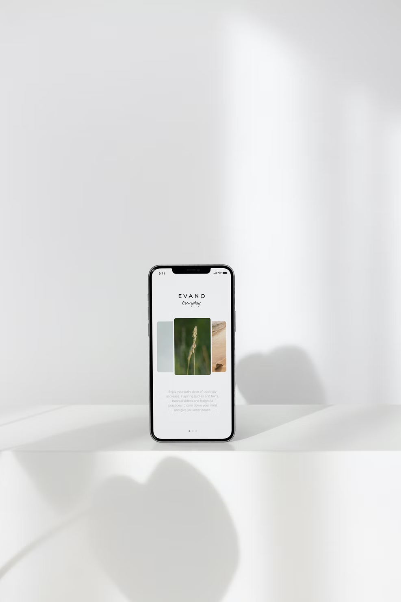
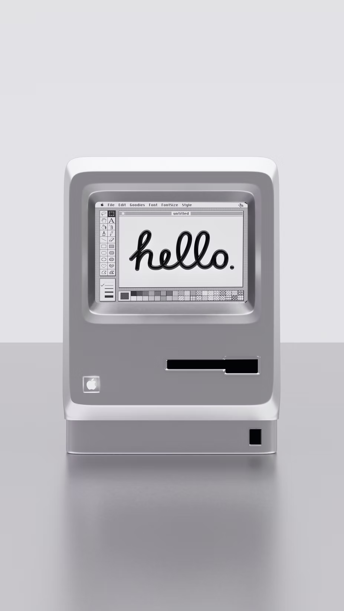

# ☝🏼 Design Portfolio

> 👋 Hi, I’m Mary - a web designer based out of San Francisco.
> 

↓ Click into each project to learn more about its creation, goal and current version.

## My projects {docsify-ignore}

🎨 **Website redesign**

🖼️ **3D Art**

And here is a regular paragraph.

™️ **Rebranding**

🛬 **Poster design**

_This [visual portfolio example](https://github.com/paulhibbitts/docsify-this-visual-portfolio-example) is based on the [Notion Portfolio Template](https://www.notion.so/templates/design-portfolio-notion)_